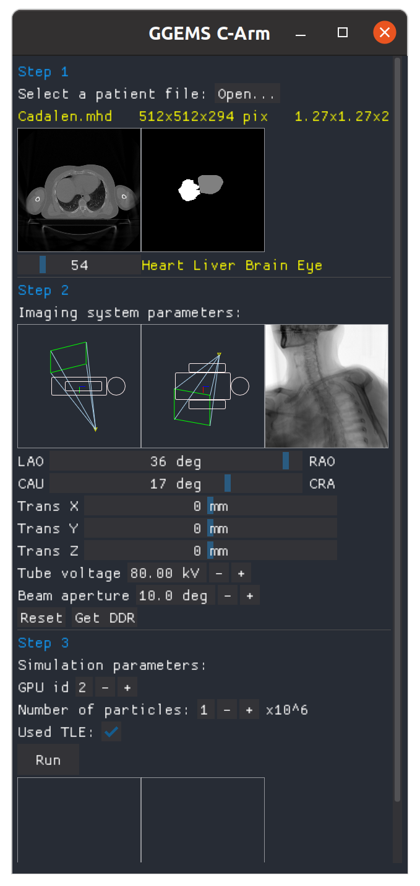

# GGEMS C-Arm 
A GGEMS GUI for C-arm dosimetry application

[](https://shields.io/)

### Screenshot



## Requirements

- python 3.7.9
- pip 21.2.4
- dearpygui 0.8.64
- numpy 1.21.2

## Installation

### Unix based

```sh
python3.7 -m venv venv
source ./venv/bin/activate
python3.7 -m pip install --upgrade pip
pip install -r requirements.txt
```

## Acknowledgment

This work was partially funded by the French National Research Agency through the OptimiX project (ANR-18-CE45- 0011)
